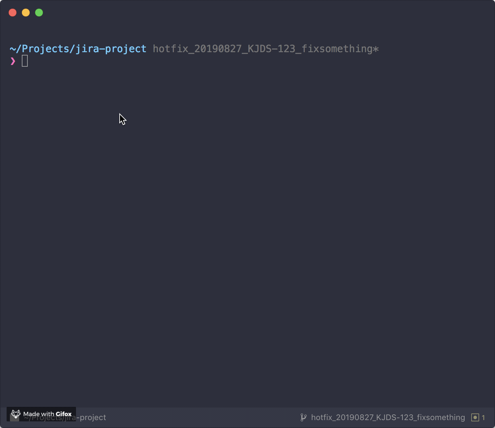

# git-hook-jira-id

Prefix jira id in every commit message using [husky](https://github.com/typicode/husky) hook



`git cm` in the gif is a shortcut for `git commit -m` customized by myself, no magic 😄

## Installation

for NPM users:

```bash
npm i git-hook-jira-id -D
```

for YARN users:

```bash
yarn add git-hook-jira-id --dev
```

## CLI Usage

```bash
Usage:
  $ git-hook-jira-id [options]

Options:
  -p, --prefix <prefix>  jira prefix
  -i, --interactive      interactive
  -h, --help             Display this message
  -v, --version          Display version number
```

**prefix**

It's used for matching jira id from your branch name

for example

```bash
git-hook-jira-id -p ABC
```

Internally it will use `/ABC-\d+/i` for searching jira id

**interactive**

If you want to prefix jira id case by case

`interactive` may be your best choice

## User guide for husky users

1. without `--interactive`, it will add jira id for every commit, it's simple but powerful

```json
"husky": {
  "hooks": {
    "prepare-commit-msg": "git-hook-jira-id -p <PREFIX>"
  }
}
```

2. with `--interactive`, you can make your own decision for every commit

```json
"husky": {
  "hooks": {
    "prepare-commit-msg": "exec < /dev/tty && git-hook-jira-id -p <PREFIX> -i || true"
  }
}
```

Remember to replace <PREFIX> with your own prefix
